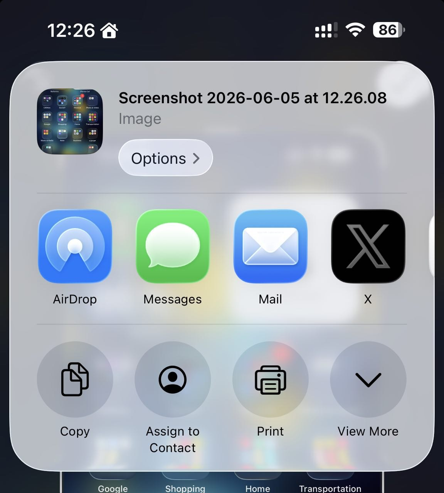
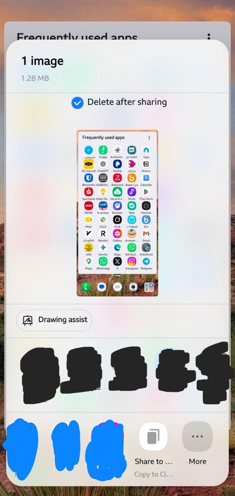

# Share to Clipboard

What is Share to Clipboard app?

iOS has a feature that let you copy what you want to share, so user can use it everywhere he/she wants regardless of destination app design.
For example when user take a screenshot and wants to use it in a reply tweet (which is not avaiable through share), he/she can just copy the screenshot and then, open the Twitter application, find desired tweet to reply and then paste the screenshot:

But there is not such option in Android. This app adds this option.

After installing, a new option will be added to your share menu that allows you to copy sharable thing into clipboard:

This app does not gather any information at all.